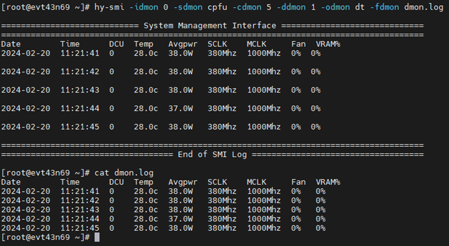

# hy-smi

## 简介

hy-smi是HYGON DCU的系统管理工具，用户可通过hy-smi对DCU进行实时监控和管理。

## 功能总览

用户可通过**hy-smi -h**查看可使用的命令行选项和说明，主要命令行选项可分为以下类别

- Optional argument
- Display options
- Topology
- Pages information
- Hardware-related information
- Software-related/controlled iinformation
- Set options
- Ecc Options
- Driver Load Options
- Reset options
- Auto-response options
- Output options
- Dmon Options
- Console Options

## 常用功能

- 查看基本信息

不加任何参数，可以查看当前环境下所有卡的下列基本信息

```
hy-smi
```


每一列含义如下

| SMI参数 |                           参数介绍                           |
| :-----: | :----------------------------------------------------------: |
|   DCU   |                      DCU设备ID，从0开始                      |
|  Temp   |                  DCU core温度，不含HBM温度                   |
| AvgPwr  |                     DCU芯片功耗，非整卡                      |
|  Perf   |             性能调度等级，默认auto，可调为manual             |
| PwrCap  | 芯片功耗限制，Z100默认230W，Z100L默认260W，K100AI默认400W，可手动设置 |
|  VRAM%  |                       DCU显存占用比例                        |
|  DCU%   |                       DCU core占用比例                       |

- 指定某张卡：-d 或 --device

```
hy-smi -d 0
# 以下命令等效
hy-smi --device 0
```


- Reset DCU

**必须**要用-d指定卡

```
hy-smi --dcureset -d 0
```


- 查看Device ID 

```
hy-smi -i
```


- 查看VBIOS版本 

```
hy-smi -v
```


- 查看时钟频率

```
hy-smi -c
```


- 如需定频，首先查看可选的clk level

```
hy-smi -s
```


- 定频设置

执行set clk的操作，根据-s查询到的clk level进行配置 > hy-smi --setsclk 1，配置clk后，perflevel会自动变成manual > hy-smi --showperflevel

```
 hy-smi --setsclk 1 -d 0
```


- 手动配置perflevel

```
hy-smi --setperflevel auto
```


- 查看内存信息

可以指定类型 vram / gtt / all

```
hy-smi --showmeminfo vram
```


- 查看RAS信息

可以指定类型 gfx / hdp / mmhub / all 等

```
hy-smi --showrasinfo all
```


- 查看当前进程信息（不支持-d）

```
hy-smi --showpids
```


- 查看DCU占用情况 

```
hy-smi -u
```


- 查看内存使用情况

```
hy-smi --showmemuse
```


- 实时监控

可指定下列选项中的一个或多个

```
hy-smi -idmon 0 -sdmon cpfu -cdmon 5 -ddmon 1 -odmon dt -fdmon dmon.log
```



- 加载驱动

驱动相关命令不支持-d

```
hy-smi --loaddriver
```


- 卸载驱动 

驱动相关命令不支持-d

```
hy-smi -unloaddriver
```


- 配置驱动开机自动加载（默认on）

```
hy-smi --autoloaddriver 0
```


- 配置驱动参数

支持同时配置多个参数，用空格隔开

配置参数后，需通过 hy-smi --loaddriver 重新加载驱动后生效

```
hy-smi --setdriverparams “noretry=0 memory_mode=0”
```


- 清空通过hy-smi配置的参数

配置参数后，需通过 hy-smi --loaddriver 重新加载驱动后生效

```
hy-smi --setdriverparams “”
```


- 查看通过hy-smi配置的驱动参数

```
hy-smi --getdriverparams
```


- 配置KM ecc模式（on / off / stable）

其中stable是KM的稳定模式，此模式下控制信息放在系统内存（ecc相关命令不支持-d）

```
hy-smi --setecc on
```


- 查看ecc模式

ZF不支持配置，只支持查看（ecc相关命令不支持-d）

```
hy-smi --showecc
```


## 异常排查

- 出现 No DRM devices available 报错，一般是因为未加载驱动


- 出现 Connect server failed: No such file or directory 报错，可能是未找到管理进程句柄，建议检查hyhal和rocm版本是否匹配


- Connect server failed: Connection refused 报错

出现 Connect server failed: Connection refused 报错，是与管理进程通讯失败，建议检查管理进程是否存在 (ps -aux | grep hymgr)，如不存在，/opt/hyhal/bin/hymon & 启动管理进程


上述异常情况是比较常见的hy-smi环境配置问题

执行命令时如有报错，可通过添加 --loglevel debug 选项查看debug信息