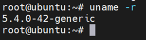
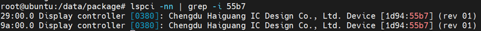
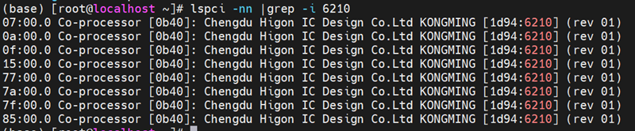
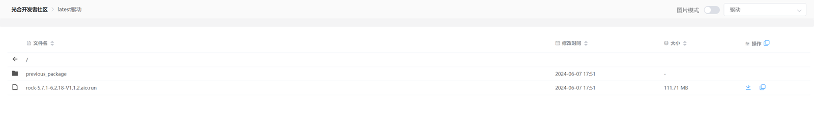
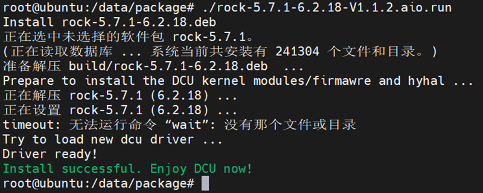
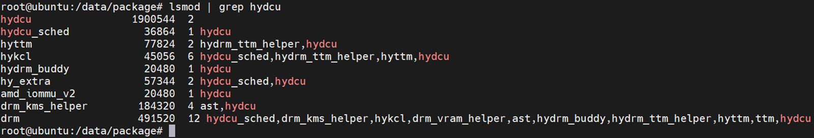
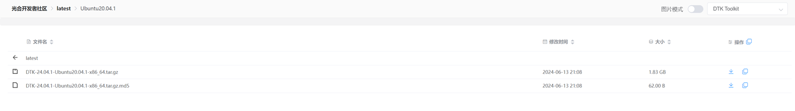
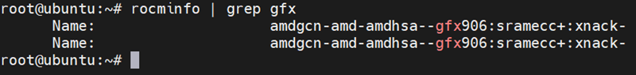
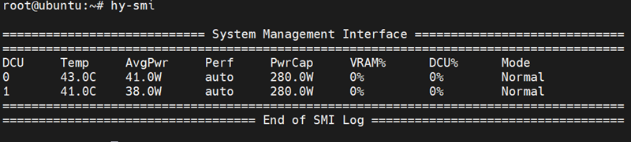

# DTK开发环境安装部署（Ubuntu版）

## 简介

该文档主要针对DCU加速卡，提供基础软件环境安装部署，包括驱动程序ROCk、软件工具包DTK。

## 基础软硬件环境

### 加速卡型号

该软件栈支持Z100、Z100L、K100和 K100_AI加速卡型号

### 软件环境

| 操作系统 | 版本    | 内核              | DCU驱动                            | DTK版本      |
| -------- | ------- | ----------------- | ---------------------------------- | ------------ |
| Ubuntu   | 20.04.1 | 5.4.0-42-generic  | rock-5.7.1-6.2.17- V1.1.1a.aio.run | DTK- 24.04.1 |
| Ubuntu   | 22.04   | 5.15.0-25-generic | rock-5.7.1-6.2.17- V1.1.1a.aio.run | DTK- 24.04.1 |

## 基础软件环境部署  

以下以Ubuntu20.04.1系统为例进行介绍。

### 操作系统配置

#### 固定系统内核

- 确认内核版本

需确保操作系统的内核版本为5.4.0-42-generic

```
uname -r
```



- 非root用户加入video组

非root用户需加入video组，以便能够使用DCU

```
# 对于有sudo权限的非root用户
sudo usermod -aG video $USER
# 对于无sudo权限的用户，由root执行
usermod -aG video <userid>
```

- 关闭内核自动更新

步骤一：

后面部分全部改成 “0”

```
sudo vi /etc/apt/apt.conf.d/10periodic
sudo vi /etc/apt/apt.conf.d/20auto-upgrades
```

步骤二：

直接使用hold参数，固定内核版本：

```
sudo apt-mark hold linux-image-5.4.0-42-generic
sudo apt-mark hold linux-headers-5.4.0-42-generic
sudo apt-mark hold linux-modules-extra-5.4.0-42-generic
```

#### 更换国内源

- 备份源文件

```
sudo mv /etc/apt/sources.list /etc/apt/sources.list.bak
```

- 创建新sources.list文件

```
sudo vim /etc/apt/sources.list
```

并添加如下内容

```
#阿里源
deb http://mirrors.aliyun.com/ubuntu/ focal main restricted universe multiverse
deb-src http://mirrors.aliyun.com/ubuntu/ focal main restricted universe multiverse
deb http://mirrors.aliyun.com/ubuntu/ focal-security main restricted universe multiverse
deb-src http://mirrors.aliyun.com/ubuntu/ focal-security main restricted universe multiverse
deb http://mirrors.aliyun.com/ubuntu/ focal-updates main restricted universe multiverse
deb-src http://mirrors.aliyun.com/ubuntu/ focal-updates main restricted universe multiverse
deb http://mirrors.aliyun.com/ubuntu/ focal-proposed main restricted universe multiverse
deb-src http://mirrors.aliyun.com/ubuntu/ focal-proposed main restricted universe multiverse
deb http://mirrors.aliyun.com/ubuntu/ focal-backports main restricted universe multiverse
deb-src http://mirrors.aliyun.com/ubuntu/ focal-backports main restricted universe multiverse
#清华源
deb http://mirrors.tuna.tsinghua.edu.cn/ubuntu/ focal main restricted
deb http://mirrors.tuna.tsinghua.edu.cn/ubuntu/ focal-updates main restricted
deb http://mirrors.tuna.tsinghua.edu.cn/ubuntu/ focal universe
deb http://mirrors.tuna.tsinghua.edu.cn/ubuntu/ focal-updates universe
deb http://mirrors.tuna.tsinghua.edu.cn/ubuntu/ focal multiverse
deb http://mirrors.tuna.tsinghua.edu.cn/ubuntu/ focal-updates multiverse
deb http://mirrors.tuna.tsinghua.edu.cn/ubuntu/ focal-backports main restricted universe multiverse+
deb http://mirrors.tuna.tsinghua.edu.cn/ubuntu/ focal-security main restricted
deb http://mirrors.tuna.tsinghua.edu.cn/ubuntu/ focal-security universe
deb http://mirrors.tuna.tsinghua.edu.cn/ubuntu/ focal-security multiverse
```

**注意：安装ubuntu22.04无需替换apt源，按默认源安装一下依赖即可**

- 更新源

```
sudo apt-get update
```

#### 安装相关依赖

安装必要的依赖包

```
# 安装 DCU 加速卡驱动所需的依赖包命令
sudo apt-get install -y cmake gcc autoconf linux-kernel-headers kernel-package automake linux-modules-extra-`uname -r` linux-image-`uname -r` linux-headers-`uname -r`
# 安装 DTK 开发环境所需的依赖包命令
sudo apt-get install -y make gcc g++ cmake git wget gfortran elfutils libdrm-dev 
sudo apt-get install -y kmod libtinfo5 sqlite3 libsqlite3-dev libelf-dev libibverbs1 libgtk2.0-0
sudo apt-get install -y libnuma-dev libgl1-mesa-dev rpm rsync mesa-common-dev apt-utils
sudo apt-get install -y cmake libpci-dev pciutils libpciaccess-dev libbabeltrace-dev pkg-config
sudo apt-get install -y libfile-which-perl libfile-basedir-perl libfile-copy-recursive-perl libfile-listing-perl
sudo apt-get install -y python3 python3-pip python3-dev python3-wheel
sudo apt-get install -y gettext gettext-base libprotobuf-dev tcl
sudo apt-get install -y libio-digest-perl libdigest-md5-file-perl libdata-dumper-simple-perl vim curl libcurlpp-dev
sudo apt-get install -y doxygen graphviz texlive libncurses5 msgpack*
sudo apt install mlocate
```

#### 查看DCU设备

根据设备码查看DCU设备

| 设备名称 | 设备码    |
| -------- | --------- |
| Z100L    | 1d94:55b7 |
| K100     | 1d94:62b7 |
| K100_AI  | 1d94:6210 |

- Z100L

```
lspci -nn | grep -i 55b7
```



- K100

```
lspci -nn | grep -i 62b7
```

- K100AI

```
lspci -nn |grep -i 6210
```



### 安装驱动

#### 下载驱动

到[光合社区](https://cancon.hpccube.com:65024/6/main/latest%E9%A9%B1%E5%8A%A8)下载最新版本驱动



#### 安装驱动包

```
chmod 755 rock-5.7.1-6.2.18-V1.1.2.aio.run
./rock-5.7.1-6.2.18-V1.1.2.aio.run
```



#### 验证安装

查看验证是否安装成功

```
lsmod | grep hydcu
```

出现如下界面说明安装成功



### 安装DTK

#### 安装mpi

- 下载[mpi.tar.gz](https://pan.baidu.com/s/1jnWfddL4lHWVQb3btD34Iw?pwd=wj6q)，并上传服务器，解压

```
sudo tar xvf mpi.tar.gz -C /opt
```

- 配置环境变量

```
sudo vim ~/.bashrc
```

在文件末尾添加如下内容

```
# mpi
export LD_LIBRARY_PATH=$LD_LIBRARY_PATH:/opt/mpi/lib
export PATH=$PATH:/opt/mpi/bin
```

- 激活环境变量

```
source ~/.bashrc
```

#### 下载并解压DTK包

- 下载DTK包

到[光合社区](https://cancon.hpccube.com:65024/1/main/latest/Ubuntu20.04.1)下载对应操作系统版本DTK包



- 解压DTK包

```
sudo tar xvf DTK-24.04.1-Ubuntu20.04.1-x86_64.tar.gz -C /opt
```

- 配置环境变量

```
sudo vim ~/.bashrc
```

在文件末尾添加如下内容

```
# dtk24.04.1
source /opt/dtk-24.04.1/env.sh
```

- 激活环境变量

```
source ~/.bashrc
```

#### 验证安装

- rocminfo

```
rocminfo | grep gfx
```



- hy-smi

```
hy-smi
```



## Q&A

- 使用root用户安装部署DTK开发环境，其他用户执行hy-smi无输出

将该root用户加入video组

```
sudo usermod -aG video $USER
```

配置环境变量

```
# mpi
export LD_LIBRARY_PATH=$LD_LIBRARY_PATH:/opt/mpi/lib
export PATH=$PATH:/opt/mpi/bin

# dtk24.04.1
source /opt/dtk-24.04.1/env.sh
```

激活环境变量

```
source ~/.bashrc
```

## 附件

光合社区文档：https://cancon.hpccube.com:65024/1/main/latest/Document