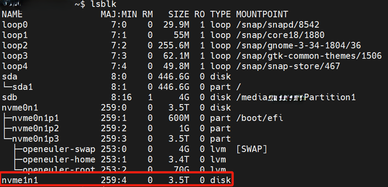
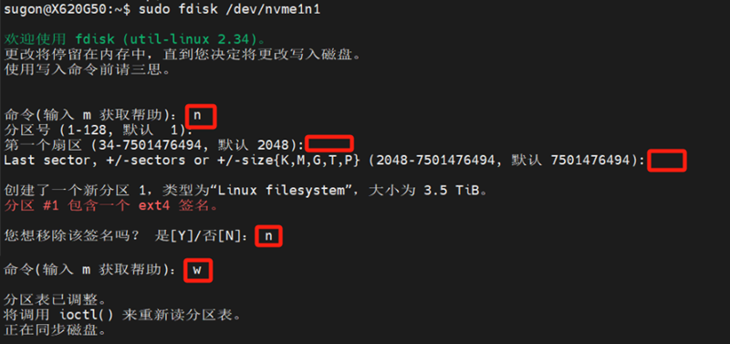
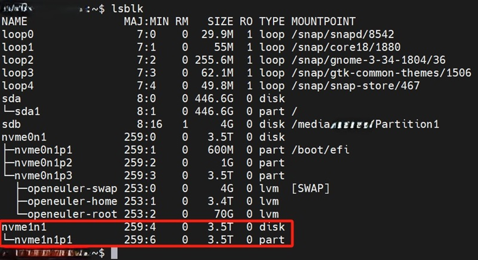
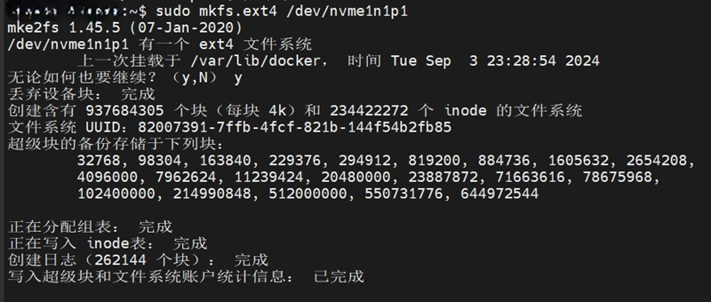

# 系统设置

## ssh远程连接

- 安装openssh-server

```
sudo apt install openssh-server
```

- 检查ssh server的状态

```
systemctl status sshd
```

确认状态是active(running）

- 设置ssh server开机启动

```
sudo systemctl enable ssh
```

## 磁盘挂载

- 查看磁盘

```
lsblk
```



可以看到一张未被挂载的磁盘nvme1n1

- 分区

```
sudo fdisk /dev/nvme1n1
```



- 查看分区

```
lsblk
```



再次查看磁盘，可以看到已增加了一个分区nvme1n1p1

- 格式化

```
sudo mkfs.ext4 /dev/nvme1n1p1
```



- 创建挂载路径并挂载

```
sudo mkdir /data
sudo mount /dev/nvme1n1p1 /data
```

- 设置开机自动挂载

使用vim编辑/etc/fstab文件

```
sudo apt install vim -y
sudo vim /etc/fstab
```

在末尾添加如下内容

```
/dev/nvme1n1p1 /data ext4 defaults 0 0
```

格式为：磁盘路径 挂载目录 ext4 defaults 0 0
