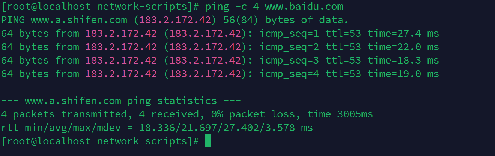

# 手动配置网卡

## 简介

网卡默认配置DHCP服务，由路由器自动分配IP地址。如果想指定IP地址，则需要将网卡配置项“BOOTPROTO”设置为“static”，而不是默认的“hhcp”。

## 操作流程

### 查看网卡

```
cd /etc/sysconfig/network-scripts/
ll
```


### 配置静态IP地址

编辑网卡文件

```
vi ifcfg-ens33
```

编辑内容如下

```
TYPE=Ethernet
PROXY_METHOD=none
BROWSER_ONLY=no
BOOTPROTO=static                             # 设置为静态路由
DEFROUTE=yes
IPV4_FAILURE_FATAL=no
IPV6INIT=yes
IPV6_AUTOCONF=yes
IPV6_DEFROUTE=yes
IPV6_FAILURE_FATAL=no
IPV6_ADDR_GEN_MODE=stable-privacy
NAME=ens33                                   # 网卡名称不用修改
UUID=a60664a3-ae64-41c0-8905-c39d677d954d    # 网卡唯一标识，不允许修改
DEVICE=ens33
ONBOOT=yes                                   # 系统在启动时激活网卡
IPADDR=192.168.2.108                         # 添加IP地址，添加前执行ping命令，不要与局域网的机器产生冲突
NETMASK=255.255.255.0                        # 子网掩码
GATEWAY=192.168.2.1                          # 网关
DNS1=192.168.2.1                             # 设置主DNS
```

重启网卡服务使其生效

```
systemctl restart network
```

查看联网情况

```
ping -c 4 www.baidu.com
```

